# Home Network Domain Project — Windows Server 2022 Active Directory Domain

**Part 3 of a home network lab series.** Parts 1 and 2 built and segmented the network; this part stands up a Windows Server 2022 Active Directory domain (`holl.domain`) on top of it — configuring the domain controller as DNS, building users/groups/policy, and joining clients across multiple VLANs, including a controlled join from an *isolated* VLAN.

## Series

- Part 1 — [OPNsense Firewall/Router Deployment](https://github.com/TannerHollaway/ReplacingHomeRouterWithOPNsense)
- Part 2 — [VLAN Segmentation and Multi-SSID Wireless Setup](https://github.com/TannerHollaway/VLAN-Segmentation-and-Multi-SSID-Wireless-Setup)
- **Part 3 — Windows Server 2022 Active Directory Domain** ← this repo
- Part 4 — [Domain Expansion & Security Instrumentation](https://github.com/TannerHollaway/Domain-Expansion-Security-Instrumentation)
- part 5 — [Splunk SIEM, Logging & Attack Simulation](https://github.com/TannerHollaway/Settinup-Up-Splunk-and-Simulating-attacks)

## Build Progress

- [x] Phase 1 — DomainMachine static IP
- [x] Phase 2 — Install AD DS + promote to Domain Controller
- [x] Phase 3 — Configure DC DNS forwarder
- [x] Phase 4 — Point VLAN 10 clients at the DC for DNS
- [x] Phase 5 — OU structure, users, and groups
- [x] Phase 6 — Group Policy (policy enforcement)
- [x] Phase 7 — Join the VM client (same VLAN)
- [x] Phase 8 — Cross-VLAN domain join (guest laptop)

---

## Overview

Active Directory Domain Services (AD DS) turns a Windows Server into the central authority for a network — holding user accounts, groups, and computers, handling authentication, and enforcing policy. This project builds a single-domain forest (`holl.domain`) on a dedicated Windows Server 2022 machine, configures it as the domain's DNS server, and joins clients so they authenticate against it and receive Group Policy.

Because the underlying network (Part 2) is segmented into isolated VLANs, this build also demonstrates that **a domain is not bound to a single VLAN**: a client on the isolated Guest VLAN joins the domain through a tightly-scoped firewall rule that reaches *only* the DC on *only* the required ports, while the rest of that VLAN's isolation stays intact — mirroring how enterprise domains span many subnets under least-privilege access.

**Skills demonstrated:** Active Directory Domain Services, AD-integrated DNS, DNS forwarding, DHCP option configuration, OU and security-group design, Group Policy creation and enforcement, domain join, virtualization for lab clients, and least-privilege cross-VLAN firewall rules.

## Architecture

```
                          Internet
                             │
                   Existing Router (192.168.1.1)
                             │
        OPNsense — firewall / router / DNS forwarder
                             │  trunk: VLANs 10 / 20 / 30
                      TL-SG108E Switch
        ┌────────────────────┴───────────────────────────┐
   VLAN 10 — Main                                   VLAN 20 — Guest
   10.10.10.0/24                                    10.20.20.0/24
   │                  │                             │
 DC01               CLIENT01                     CLIENT02
 DC + DNS           (VM, domain client)          (laptop, domain client
 10.10.10.10                                      via a narrow Guest→DC rule)
```

## Machines

| Machine      | Role                        | OS                      | Network         | Address |
| ------------ | --------------------------- | ----------------------- | --------------- | ------- |
| **DC01**     | Domain Controller + DNS     | Windows Server 2022 Std | VLAN 10 (Main)  | `10.10.10.10` (static) |
| **CLIENT01** | Domain client (same VLAN)   | Windows 11              | VLAN 10 (Main)  | DHCP |
| **CLIENT02** | Domain client (cross-VLAN)  | Windows 11              | VLAN 20 (Guest) | DHCP |

> The main rig itself stays unjoined — `CLIENT01` is a VM hosted on it, keeping the bare-metal machine and its data untouched.

## Domain & IP Plan

| Item              | Value |
| ----------------- | ----- |
| Domain (DNS) name | `holl.domain` |
| NetBIOS name      | `HOLL` |
| DC hostname       | `DC01` |
| DC IP             | `10.10.10.10` /24 |
| DC gateway        | `10.10.10.1` (OPNsense, VLAN 10) |
| DC DNS            | itself (`10.10.10.10`) |
| DC forwarder      | `10.10.10.1` (OPNsense) |

## Network Context (from Parts 1 & 2)

| VLAN | Name       | Subnet          | Gateway      | DHCP / DNS |
| ---- | ---------- | --------------- | ------------ | ---------- |
| —    | Native LAN | `10.0.0.0/24`   | `10.0.0.1`   | Infra (OPNsense `.1`, switch `.2`, AP `.3`) |
| 10   | Main       | `10.10.10.0/24` | `10.10.10.1` | dnsmasq → DC for DNS (Phase 4) |
| 20   | Guest      | `10.20.20.0/24` | `10.20.20.1` | dnsmasq (isolated) |
| 30   | IoT        | `10.30.30.0/24` | `10.30.30.1` | dnsmasq (isolated) |

DHCP and DNS are served by **dnsmasq** on OPNsense. Part 3 changes the DNS source for VLAN 10 clients to the domain controller.

---

## Phase 1 — DomainMachine Static IP

**Why:** A domain controller must always be reachable at the same address — every client locates the domain by IP/DNS, so a DHCP-assigned address that could change would break the domain. The DC also points its own DNS at itself, since it is about to become the DNS server for `holl.domain`.

**What was done:** Set the server's Ethernet adapter to a static IP — `10.10.10.10` /24, gateway `10.10.10.1`, preferred DNS `10.10.10.10` (itself).

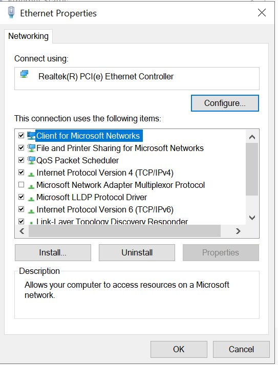
*The DomainMachine's Ethernet adapter properties during static-IP setup.*

---

## Phase 2 — Install AD DS + Promote to Domain Controller

**Why:** Installing the AD DS role provides the Active Directory binaries; *promoting* the server creates the domain (`holl.domain`) and makes it the first domain controller. AD-integrated DNS installs alongside it, since AD relies on DNS for clients to locate domain services.

**What was done:** Added the **Active Directory Domain Services** role, then promoted the server into a **new forest** with root domain `holl.domain`. The server was renamed to `DC01` and rebooted.

> During promotion, a warning appeared — *"A delegation for this DNS server cannot be created because the parent zone cannot be found."* This is expected and was safely ignored: `holl.domain` is a self-contained lab domain with no real public parent zone (`.domain`) to register a delegation in. The DC is authoritative for `holl.domain`, which is all the lab needs.

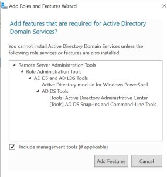
*Adding the AD DS role and its required management features.*

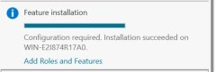
*Role installation completed on the server (before the rename to DC01).*

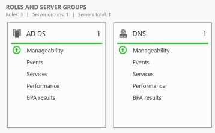
*Server Manager showing the AD DS and DNS roles healthy after promotion.*

---

## Phase 3 — Configure DC DNS Forwarder

**Why:** After promotion the DC is authoritative for `holl.domain`, but it still needs to resolve external names. A forwarder sends any query it isn't authoritative for upstream to OPNsense, keeping all external DNS flowing through the firewall — useful for central logging and future filtering.

**What was done:** In DNS Manager, set the forwarder to `10.10.10.1` (OPNsense). Verified with `nslookup google.com` from DC01, which resolved successfully.

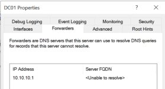
*DC01's DNS forwarder pointed at OPNsense (`10.10.10.1`). The "Unable to resolve" FQDN beside it is cosmetic — OPNsense has no PTR record — and does not affect forwarding.*

---

## Phase 4 — Point VLAN 10 Clients at the DC for DNS

**Why:** Domain clients locate the domain via DNS SRV records that live on the DC. By default dnsmasq hands out OPNsense as the DNS server, so clients would never see those records and couldn't join. This change tells VLAN 10 clients to use the DC (`10.10.10.10`).

**What was done:** Added a dnsmasq DHCP option (`dns-server [6]` → `10.10.10.10`) scoped to the Main VLAN interface — selecting the interface auto-tags it, so no manual Tag is needed. Applied, then renewed a client's lease.

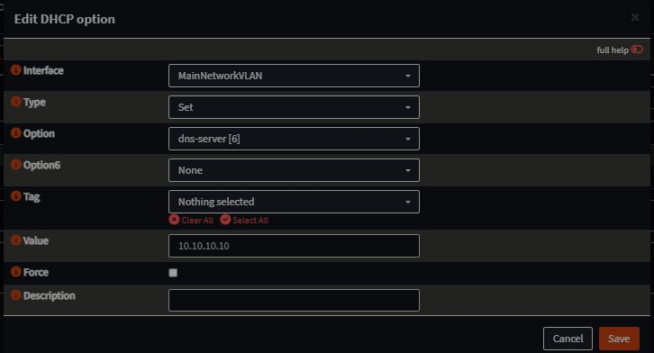
*The DHCP option: `dns-server [6]` → `10.10.10.10`, scoped to the Main VLAN interface.*

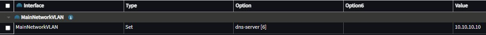
*A VLAN 10 client reporting `DNS Servers: 10.10.10.10` after the change.*

---

## Phase 5 — OU Structure, Users, and Groups

**Why:** This is the core of Active Directory. **OUs** organize objects and are the targets for Group Policy; **users** are the login accounts; **groups** bundle users so permissions and policy attach to a role rather than to individuals.

**Structure built:**
```
holl.domain
└── OU: Lab
    ├── OU: Users        → jdoe (standard user)
    ├── OU: Groups       → IT-Staff (global security group; member: jdoe)
    └── OU: Computers    → domain-joined clients
```

A single top-level `Lab` OU is intentional for a lab this size; nested per-department trees are how this scales in production. Custom OUs can be GPO targets, whereas the built-in `Users`/`Computers` containers cannot — which is why joined clients are moved into `Lab/Computers`.

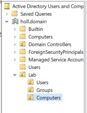
*The Lab OU with Users / Groups / Computers sub-OUs.*

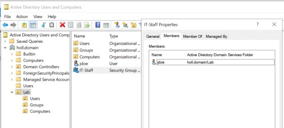
*The `jdoe` account and the `IT-Staff` security group, with jdoe shown as a member.*

---

## Phase 6 — Group Policy (Policy Enforcement)

**Why:** Group Policy is how a domain pushes configuration and security settings to its members automatically — proving the domain doesn't just authenticate users, it manages them. GPOs link to **OUs**, not groups; a link to `Lab` reaches everything inside it, including `Lab/Computers` via inheritance.

**What was done:** Created a single **`Lab Security Baseline`** GPO linked to the `Lab` OU, with:
- **Interactive logon banner** — title `Authorized Use Only` plus an authorized-use / monitoring message.
- **Machine inactivity limit** = `900` seconds (auto-lock).

> **Deliberate exception:** an *All Removable Storage classes: Deny all access* setting was created and tested, then intentionally disabled because USB/removable storage is operationally required in this environment — a conscious baseline decision rather than a blanket control.

All settings are **Computer-side**, so they apply to machines under `Lab`, not to user objects directly.

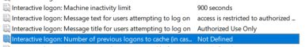
*The baseline's logon-banner title/text and the 900-second machine inactivity limit.*


*The removable-storage "Deny all access" setting (later disabled — see exception above).*

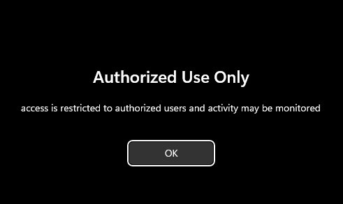
*Enforcement confirmed: the banner appears at sign-in on a joined client.*

---

## Phase 7 — Join the VM Client (Same VLAN)

**Why:** `CLIENT01` lives on VLAN 10 alongside the DC, so it reaches the domain with no firewall changes — the simplest possible join, used to confirm the domain, DNS, and policy are healthy before adding cross-VLAN complexity.

**What was done:** Joined the Windows 11 VM (bridged onto VLAN 10) to `holl.domain` using the domain Administrator account, moved its computer object into `Lab/Computers`, ran `gpupdate /force`, and confirmed the banner at sign-in. Logged in as `HOLL\jdoe` to validate standard-user access.

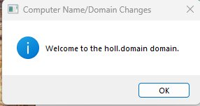
*CLIENT01 (VM) joined to holl.domain.*

---

## Phase 8 — Cross-VLAN Domain Join (Guest Laptop)

**Why:** This demonstrates a domain spanning VLANs. `CLIENT02` stays on the isolated Guest VLAN; a **narrow** firewall rule lets it reach *only* the DC on *only* the AD ports — a least-privilege exception that leaves the rest of Guest isolation intact.

**What was done:**
1. Gave the laptop a static IP `10.20.20.50` with DNS pointed at the DC (`10.10.10.10`) — the Guest DHCP scope doesn't hand out the DC.
2. Created two OPNsense aliases: host `DC01` = `10.10.10.10`, and port `AD_Ports` = `53, 88, 123, 135, 389, 445, 464, 3268, 49152:65535`.
3. Added a Pass rule on the Guest interface (source = laptop, destination = `DC01`, ports = `AD_Ports`, TCP/UDP) and **placed it above the RFC1918 block** — rules match top-down, first match wins.
4. Verified the path (`nslookup holl.domain` → DC), joined `holl.domain`, and moved the computer object into `Lab/Computers`.

**AD ports opened (client → DC):** 53 DNS, 88 Kerberos, 123 NTP, 135 RPC endpoint mapper, 389 LDAP, 445 SMB, 464 Kerberos password change, 3268 Global Catalog, and 49152–65535 (RPC dynamic range).

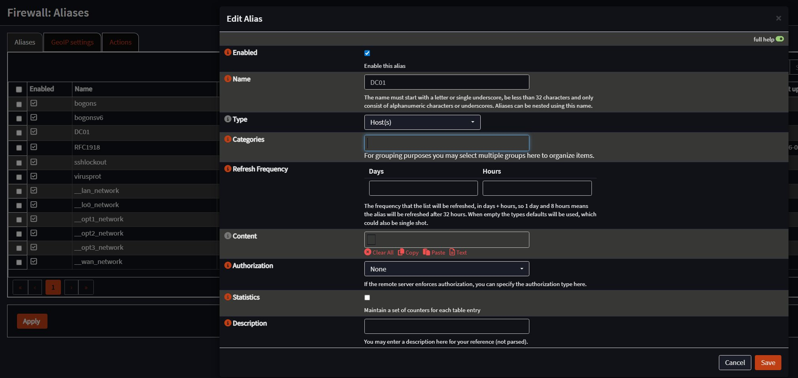
*The `DC01` host alias (`10.10.10.10`) in OPNsense.*


*The narrow laptop→DC allow rule, placed above the RFC1918 block on the Guest interface.*

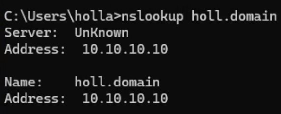
*From the Guest laptop, `nslookup holl.domain` resolves to the DC through the new rule.*

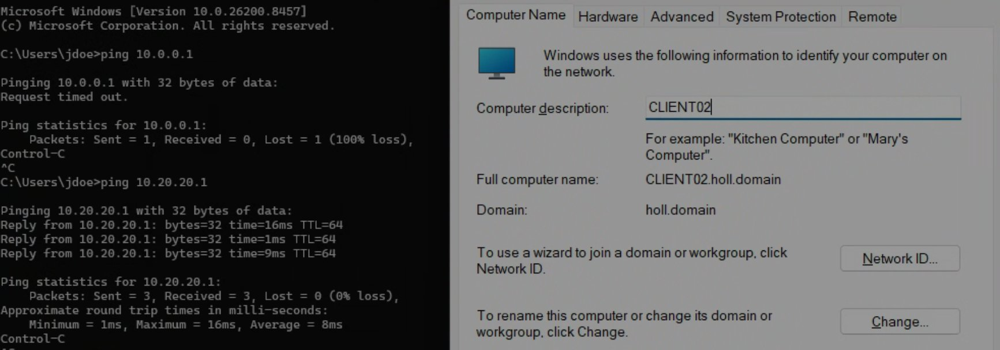
*CLIENT02 joined to holl.domain from the Guest VLAN. `ping 10.0.0.1` (internal infrastructure) times out — isolation intact — while the Guest gateway still answers.*

---

## Verification

| Test | Command / Check | Expected | Result |
| ---- | --------------- | -------- | ------ |
| Client DNS points to DC | `ipconfig /all` | DNS = `10.10.10.10` | ✅ |
| DC resolves internet | `nslookup google.com` from DC | Resolves | ✅ |
| Domain join (VM) | join `holl.domain` | Success | ✅ `CLIENT01` |
| GPO applies | banner shown at sign-in | Applied | ✅ |
| Cross-VLAN join (laptop) | join from Guest VLAN | Success | ✅ `CLIENT02` |
| Guest isolation intact | `ping 10.0.0.1` from laptop | Times out | ✅ |

---

## Troubleshooting

### Issue 1 — Client kept using OPNsense for DNS after pushing the DC via DHCP

**Symptom:** After adding the `dns-server [6]` DHCP option for the Main VLAN, a VLAN 10 client still showed `DNS Servers: 10.10.10.1` (OPNsense) in `ipconfig /all`.

**What was checked:** Confirmed the option was scoped correctly (interface auto-tags, no manual Tag needed), that it was **Applied** and not just saved, restarted dnsmasq, and forced a full DHCP release/renew (gateway and DNS briefly dropped on release, confirming a genuinely fresh lease). DNS still did not change.

**Root cause:** The client's adapter had a **statically configured DNS server** (`10.10.10.1`). A manual DNS entry overrides whatever DHCP hands out, so the DHCP option was being silently ignored at the client.

**Resolution:** Set the adapter to *Obtain DNS server address automatically*, then `ipconfig /release` + `/renew`. DNS then showed `10.10.10.10` — which also confirmed the DHCP option had been correct all along.

**Lesson learned:** When a DHCP-pushed setting won't take effect despite correct server-side config and a confirmed fresh lease, check whether the client is statically overriding it. `netsh interface ip show dnsservers` is the quick tell — *"Statically Configured DNS Servers"* vs *"DNS servers configured through DHCP."*

---

## Outcome

All eight phases complete. A single-domain Active Directory forest (`holl.domain`) runs on **DC01** (Windows Server 2022), which also serves AD-integrated DNS with a forwarder to OPNsense for external resolution. VLAN 10 clients receive the DC as their resolver through a scoped dnsmasq DHCP option. The directory holds a `Lab` OU structure (Users / Groups / Computers), a standard user (`jdoe`), and a security group (`IT-Staff`). A **`Lab Security Baseline`** GPO enforces an interactive logon banner and a 900-second inactivity lock, verified live on joined clients.

Two clients are domain members: **`CLIENT01`** (VM on VLAN 10, the straightforward same-subnet join) and **`CLIENT02`** (laptop on the *isolated* Guest VLAN, joined through a least-privilege firewall rule permitting only the AD ports to the DC). Cross-VLAN isolation was confirmed intact — the Guest client can reach the domain controller and nothing else internal.

**Key concept demonstrated:** an AD domain is independent of network segmentation. Domain membership is governed by what each host can *reach* (firewall + DNS), and that reach is granted by least privilege rather than flat connectivity — a controlled exception to an isolated VLAN, not an open door.

---

## Next Steps

**Part 4 (planned):** stand up a deliberately vulnerable, domain-joined VM for vulnerability scanning, remediation, and log-review practice (incident-response focus), and forward DC + client event logs to a SIEM for centralized detection and alerting.
